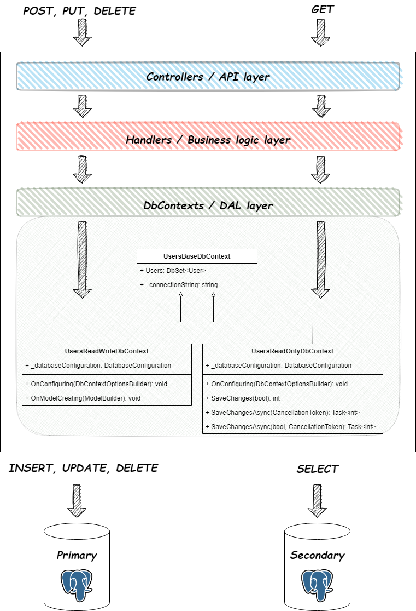
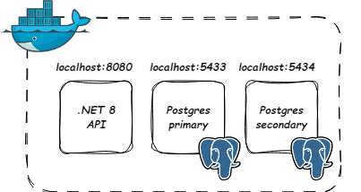

# CQRS
  

This project is a PoC of queries distribution between replicas of postgres databases

## Table of contents
* [General info](#general-info)
* [Technologies](#technologies)
* [Setup](#setup)
* [Status](#status)
* [Inspiration](#inspiration)

## General info

The idea was to split databse contexts into three:
1. _Base_ - base database contexts from which remaining contexts are inheriting `DbSet<T>` properties from
2. _ReadWrite_ - the context that that can run SELECTs, UPDATEs, INSERTs and DELETEs. This database context is utilized by CQRS handlers which take CQRS commands as input 
3. _ReadOnly_ - the context that that can run only SELECTs. This database context is utilized by CQRS handlers which take CQRS queries as input. This class overrides `SaveChanges` and `SaveChangesAsync` methods and throws an error in case they are invoked

On the database level seperation is done by creation of replica and usage od dedicated connection string. Replica accepts only read only queries where as primary database accepts all queries. _ReadOnly_ context utilizes connection string with `ro_user` database user where as _ReadWrite_ context utilizes connection string with `rw_user`.

Pic.1 Visualization of the project

Overall project are three docker containers. One with .NET API and two with postgres databases - one primary database and one replica. 

Pic.2 Visualization of docker compose project

## Technologies
* .NET 8
* Postgres
* Docker

## Setup
1. Run docker compose in src folder: `docker-compose up`
2. API should be accessible from http://localhost:8080/swagger/index.html

## Status
Project is: _finished_

## Inspiration
Performance problems
